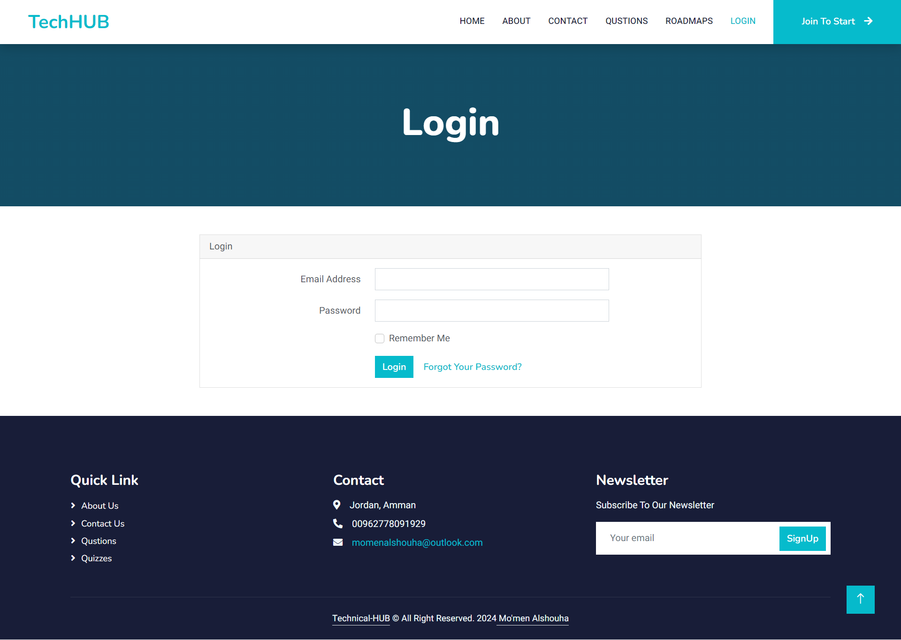
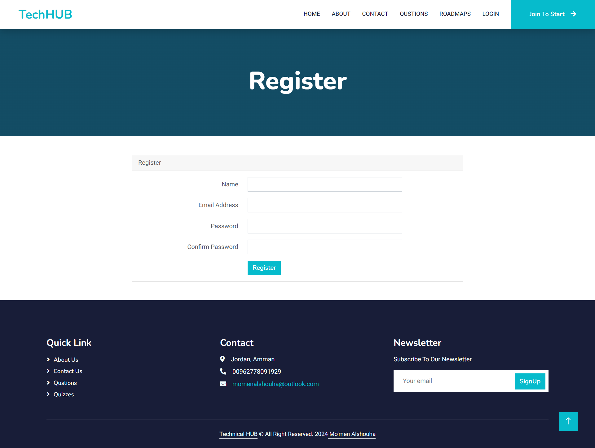

# Technical Hub

## Overview

Technical Hub is a Laravel project designed to provide a centralized platform for accessing commonly asked interview questions, recommended courses, and technical roadmaps in various fields.

## Features and Functionality

- **Browse Interview Questions:** Access a comprehensive collection of frequently asked interview questions.
  
- **Discover Recommended Courses:** Explore recommended courses to enhance your skills in specific areas.

- **View Technical Roadmaps:** Access technical roadmaps to guide your learning journey.

- **Admin Dashboard:** An admin dashboard is available to manage content.

## Some Screenshots






## Installation

Before proceeding with the installation, ensure you have Apache installed and configured on your system. Additionally, make sure you have created a MySQL database named `technical_hub`.

1. **Clone the repository:**

    ```
    git clone https://github.com/Momen-Alshouha/technical-hub.git
    ```

2. **Navigate into the project directory:**

    ```
    cd technical-hub
    ```

3. **install composer**

    ```
    composer install
    ```
    
4. **Copy `.env.example` to `.env`:**

    ```
    cp .env.example .env
    ```

5. **Generate application key:**

    ```
    php artisan key:generate
    ```

6. **Migrate the database:**

    ```
    php artisan migrate
    ```

7. **Run the database seeder:**

    ```
    php artisan db:seed
    ```
    
8. **Serve the application:**

    ```
    php artisan serve
    ```

## Login Credentials

### Admin
- **Email:** admin@gmail.com
- **Password:** admin123

### User
- **Email:** user@gmail.com
- **Password:** user123


Once the server is running, access the application through your web browser.

## Note:

- Ensure Apache is installed and configured properly.
- Create a MySQL database named `technical_hub` before running migrations.

